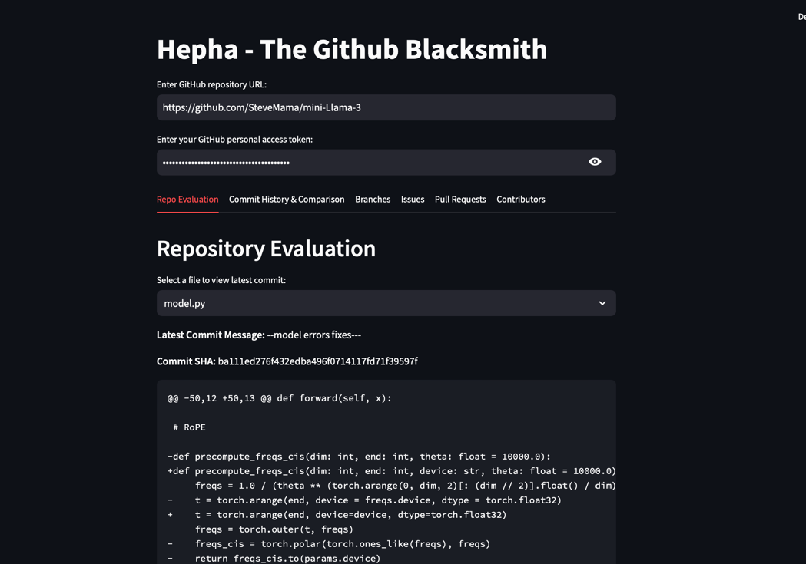

# Hepha - The Github Blacksmith

-------
- Named after Hephaestus: Greek God of Tooling and Mettalurgy.
- Hepha does all the heavy work for you: be it code eval. vulnerabilities check
- Powered by Modular RAG and LLM.
### Currently under development.

---

